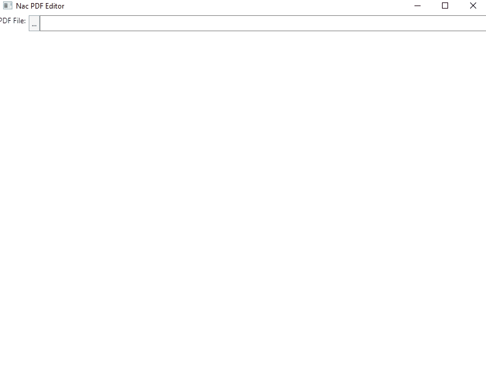

# NAC PDF Editor

## Plan
+ Developed on linux, but run on Windows/MacOS
+ These are the planned features
    + PDF Merge using itextsharp
        + [ ] Merge before/after a specific page
        + [ ] Merge at beginning or end
    + PDF Page Rotation
        + [X] Rotate left (90)
        + [X] Rotate Right (90)
        + [ ] Flip (Rotate left twice 180)
    + PDF Page Move
        + [ ] Move a page before or after another page
    + PDF Page Deletion
        + [ ] Delete a page number
    + PDF File management
        + [ ] Provide a save button
        + All the PDF changes will happen to a copy of the pdf they load.  The temporary pdf file will be stored in some temporary folder that is managed.
+ Distribute the project with chocolatey on windows
    + Use dotnet publish to make a single EXE
    + Create a powershell to submit to chocolatey via an api key

## Dependencies
+ Avalonia  (via nac.forms)
+ ImageSharp (converting raw pixels to bitmap for Avalonia Image control)
+ docnet.core (Render PDF pages as Images)
    + Is a wrapper for Google PDFIum
+ itextsharp (PDF Manipulation)
    
## Progress Screenshots
+ PDF Rotation
    + 